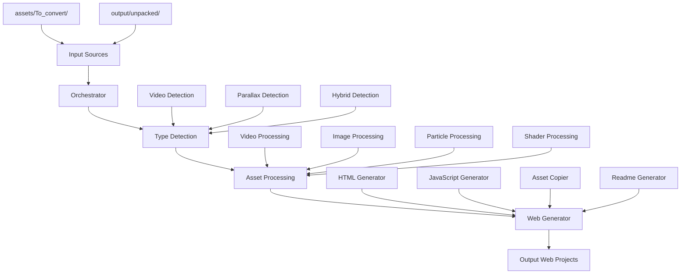
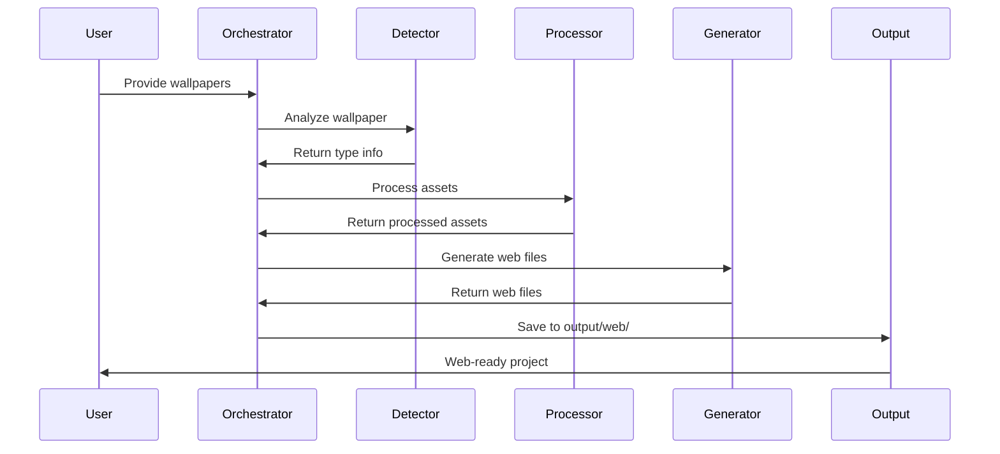
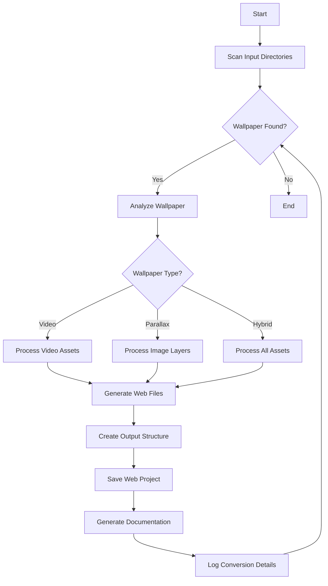

# Wallpaper Engine to Web Exporter - Technical Specification

## 1. Overview

The Wallpaper Engine to Web Exporter is a Python-based tool that converts Wallpaper Engine scene wallpapers into self-contained web projects. The tool processes both raw `.pkg` files and already unpacked wallpapers, generating lightweight HTML + JS templates that run smoothly in any browser.

### 1.1 Project Vision

Convert Wallpaper Engine wallpapers (from .pkg or .mp4/.webm) into self-contained web projects. Users should be able to take a wallpaper, drop it into the pipeline, and receive a folder with:

```
output/web/{wallpaper_id}/
├─ index.html
├─ script.js
├─ assets/ (images, video, audio, etc.)
└─ readme.md
```

Each generated folder should run as a standalone interactive website.

## 2. System Architecture



### 2.1 Core Components

1. **Orchestrator**: Main Python script that coordinates the entire conversion process
2. **Type Detection**: Analyzes wallpaper structure to determine conversion approach
3. **Asset Processing**: Handles copying and conversion of assets
4. **Web Generator**: Creates HTML, JavaScript, and documentation files
5. **Output Manager**: Organizes generated files into web-ready structure

## 3. Data Flow



## 4. Module Design

### 4.1 Directory Structure

```
wall2web/
├─ assets/
│   ├─ To_convert/          # Raw wallpapers (.pkg files)
│   └─ web/                 # Generated web projects (output)
├─ convertor/
│   ├─ __init__.py          # Package initialization
│   ├─ orchestrator.py      # Main conversion coordinator
│   ├─ detector.py          # Wallpaper type detection
│   ├─ processor.py         # Asset processing
│   ├─ generator.py         # Web file generation
│   ├─ unpacker.py          # .pkg unpacking (existing)
│   └─ analyzer.py          # Wallpaper analysis (existing)
├─ output/
│   └─ unpacked/            # Unpacked wallpapers (intermediate)
├─ technical_specification.md
├─ wallpaper_analysis_report.md
├─ README.md
└─ RePKG.exe
```

### 4.2 Core Modules

#### 4.2.1 Orchestrator (`convertor/orchestrator.py`)

The main coordinator that:
- Walks through input directories
- Calls detector for each wallpaper
- Routes to appropriate processor based on type
- Calls generator to create web project
- Manages output organization

#### 4.2.2 Detector (`convertor/detector.py`)

Analyzes wallpaper structure to determine type:
- **Video wallpapers**: Contains .mp4, .webm, or .gif files
- **Parallax wallpapers**: Multiple image layers with parallaxDepth values
- **Hybrid wallpapers**: Combination of particles, effects, and shaders

#### 4.2.3 Processor (`convertor/processor.py`)

Handles asset processing based on type:
- Copies relevant files to output structure
- Converts TEX to PNG (already handled by RePKG)
- Optimizes assets for web delivery

#### 4.2.4 Generator (`convertor/generator.py`)

Creates web-ready files:
- `index.html`: Base structure with CDN links
- `script.js`: Interactive logic using Pixi.js
- `readme.md`: Documentation with conversion details

## 5. Implementation Approach

### 5.1 Video Wallpapers

**Detection Criteria**:
- Presence of .mp4, .webm, or .gif files in materials/
- Audio files (.mp3, .ogg) in sounds/

**Implementation**:
```html
<!-- index.html -->
<video autoplay loop muted playsinline>
  <source src="assets/background.mp4" type="video/mp4">
</video>
<audio autoplay loop hidden>
  <source src="assets/background.mp3" type="audio/mpeg">
</audio>
```

### 5.2 Image + Parallax Wallpapers

**Detection Criteria**:
- Multiple PNG/JPG layers in materials/
- Objects with parallaxDepth values in scene.json

**Implementation**:
```javascript
// script.js with Pixi.js
const app = new PIXI.Application({
  width: window.innerWidth,
  height: window.innerHeight,
  backgroundColor: 0x00000
});

// Load layers with depth values
const layers = [
  { url: 'assets/background.png', depth: 0.1 },
  { url: 'assets/middle.png', depth: 0.5 },
  { url: 'assets/foreground.png', depth: 1.0 }
];

// Implement mousemove parallax
document.addEventListener('mousemove', (e) => {
 const x = e.clientX / window.innerWidth - 0.5;
  const y = e.clientY / window.innerHeight - 0.5;
  
  layers.forEach((layer, i) => {
    layer.sprite.x = x * layer.depth * 50;
    layer.sprite.y = y * layer.depth * 50;
  });
});
```

### 5.3 Hybrid Wallpapers

**Detection Criteria**:
- Presence of particles/, effects/, or shaders/ directories
- Complex combination of the above

**Implementation**:
1. **Particles**: Map particles/*.json into Pixi.js emitters
2. **Effects**: Try CSS/WebGL shader filter or fallback to animated sprites
3. **Shaders**: Try injecting into Pixi.js/Three.js as custom filters or fallback to static layers

## 6. File Structure

### 6.1 Input Sources

```
assets/To_convert/
├─ {wallpaper_id}/
│   ├─ project.json
│   ├─ scene.pkg
│   └─ shaders/ (optional)
└─ ... (more wallpapers)

output/unpacked/
├─ {wallpaper_id}/
│   ├─ project.json
│   ├─ scene.json
│   ├─ materials/
│   ├─ particles/ (optional)
│   ├─ effects/ (optional)
│   ├─ shaders/ (optional)
│   └─ sounds/ (optional)
└─ ... (more wallpapers)
```

### 6.2 Output Structure

```
output/web/
├─ {wallpaper_id}/
│   ├─ index.html
│   ├─ script.js
│   ├─ assets/
│   │   ├─ *.png
│   │   ├─ *.mp4
│   │   ├─ *.mp3
│   │   └─ ... (processed assets)
│   └─ readme.md
└─ ... (more web projects)
```

## 7. Detailed Module Specifications

### 7.1 Orchestrator Module

**Responsibilities**:
- Directory traversal and management
- Coordination between modules
- Error handling and logging
- Progress reporting

**Interface**:
```python
def process_all_wallpapers():
    """Process all wallpapers in input directories"""
    pass

def process_wallpaper(wallpaper_path):
    """Process a single wallpaper"""
    pass
```

### 7.2 Detector Module

**Responsibilities**:
- Analyze wallpaper structure
- Determine wallpaper type
- Extract metadata and asset list

**Interface**:
```python
def detect_wallpaper_type(wallpaper_path):
    """Analyze wallpaper and return type information"""
    pass

def extract_metadata(wallpaper_path):
    """Extract title, author, resolution, etc."""
    pass

def list_assets(wallpaper_path):
    """List all relevant assets"""
    pass
```

### 7.3 Processor Module

**Responsibilities**:
- Copy and convert assets
- Optimize for web delivery
- Handle different asset types appropriately

**Interface**:
```python
def process_video_wallpaper(wallpaper_path, output_path):
    """Process video-based wallpaper"""
    pass

def process_parallax_wallpaper(wallpaper_path, output_path):
    """Process parallax-based wallpaper"""
    pass

def process_hybrid_wallpaper(wallpaper_path, output_path):
    """Process hybrid wallpaper"""
    pass
```

### 7.4 Generator Module

**Responsibilities**:
- Generate HTML structure
- Create JavaScript logic
- Write documentation
- Handle template rendering

**Interface**:
```python
def generate_html(wallpaper_info, output_path):
    """Generate index.html"""
    pass

def generate_javascript(wallpaper_info, output_path):
    """Generate script.js"""
    pass

def generate_readme(wallpaper_info, output_path):
    """Generate readme.md"""
    pass
```

## 8. Extensibility Considerations

### 8.1 Shader GLSL Support

**Current State**: Shaders are in HLSL format
**Future Enhancement**: 
- Translate HLSL to GLSL for WebGL compatibility
- Implement shader compiler/transpiler
- Fallback to pre-rendered videos for complex shaders

### 8.2 WASM RePKG Integration

**Current State**: Using external RePKG.exe
**Future Enhancement**:
- Integrate WASM version of RePKG
- Eliminate external dependency
- Improve performance and reliability

### 8.3 Plugin Architecture

**Design Pattern**: 
- Modular processors for different wallpaper types
- Extensible generator templates
- Configurable conversion strategies

### 8.4 Performance Optimizations

- Lazy loading of assets
- Asset compression and optimization
- Caching of processed wallpapers
- Parallel processing capabilities

## 9. Technology Stack

### 9.1 Backend
- **Language**: Python 3
- **Dependencies**: None (standard library preferred)
- **External Tools**: RePKG.exe (for unpacking)

### 9.2 Frontend Runtime
- **Primary**: Pixi.js (CDN link in HTML)
- **Fallbacks**: Three.js for complex 3D effects
- **Utilities**: Vanilla JavaScript for DOM manipulation

### 9.3 Asset Processing
- **Images**: PNG/JPG (converted from TEX by RePKG)
- **Videos**: MP4/WebM (copied as-is or converted)
- **Audio**: MP3/OGG (copied as-is or converted)

## 10. Conversion Process Flow



## 11. Error Handling and Validation

### 11.1 Input Validation
- Verify wallpaper structure integrity
- Check for required files (project.json, scene.json)
- Validate asset formats and compatibility

### 11.2 Processing Errors
- Handle missing assets gracefully
- Provide fallback mechanisms
- Log detailed error information

### 11.3 Output Validation
- Verify generated files integrity
- Check web compatibility
- Validate asset references

## 12. Performance Considerations

### 12.1 Memory Management
- Process wallpapers one at a time
- Clean up temporary files
- Optimize asset loading

### 12.2 Processing Speed
- Parallel asset copying where possible
- Efficient file operations
- Caching of analysis results

### 12.3 Output Optimization
- Compress assets for web delivery
- Minify generated JavaScript
- Optimize image quality/size balance

## 13. Testing Strategy

### 13.1 Unit Tests
- Test each module independently
- Validate parsing functions
- Check output generation

### 13.2 Integration Tests
- Test complete conversion pipeline
- Validate cross-module interactions
- Check output structure integrity

### 13.3 End-to-End Tests
- Test with real wallpaper samples
- Verify browser compatibility
- Check performance metrics

## 14. Deployment and Distribution

### 14.1 Packaging
- Single Python script distribution
- Include RePKG.exe dependency
- Documentation and examples

### 14.2 Installation
- Simple pip installation
- Clear setup instructions
- Dependency management

### 14.3 Usage
- Command-line interface
- Configuration options
- Progress reporting

## 15. Future Enhancements

### 15.1 Advanced Features
- Real-time shader translation
- 3D model support
- Audio visualization
- Physics simulation

### 15.2 Platform Support
- Cross-platform compatibility
- WebAssembly integration
- Mobile optimization

### 15.3 User Experience
- GUI interface
- Batch processing
- Preview generation
- Custom template support

---

*This technical specification provides a comprehensive overview of the Wallpaper Engine to Web Exporter project. It outlines the architecture, implementation approach, and future considerations for converting Wallpaper Engine scenes into web-ready interactive backgrounds.*